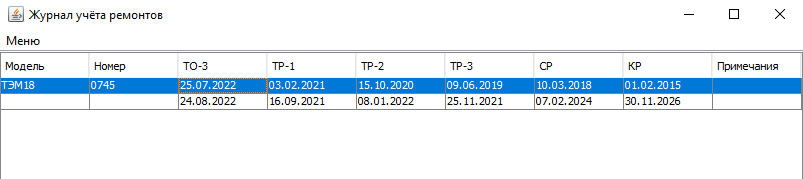
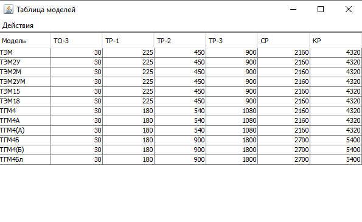
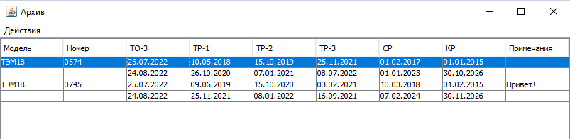

# Журнал учёта ремонтов для локомотивного депо
Данная прикладная программа упрощает учёт произведённых и предстоящих ремонтов тепловозов для сотрудников локомотивного депо.  
После указания предыдущего ремонта определённой разновидности, даты следующих ремонтов будут рассчитаны автоматически, с учётом установленных периодов ремонтов для каждой конкретной модели тепловоза.

---

## Содержание
* [Установка на Windows](#установка-на-windows)
* [Установка на GNU/Linux](#установка-на-gnulinux)
* [Работа с журналом](#работа-с-журналом-учёта)
* [Версия](#версия)

---

### Установка на Windows
1. Загрузите [zip архив для *Windows*](https://drive.google.com/file/d/12XafrI6UhdHyBA9kn99YvJmv0vP-YCwX/view?usp=sharing)
2. Распакуйте содержимое архива в любую папку.
3. Запустите приложение двойным щелчком по файлу с названием *"Журнал учёта"*.

> Примечание: для работы приложения требуется среда выполнения Java программ (*Java Runtime Environment*).
>
> Если приложение не обнаружит на компьютере JRE, при запуске будет показано соответствующее сообщение.
> Нажав "OK", вы перейдете на официальный сайт Oracle, где можно загрузить установщик JRE.
>
> После загрузки запустите установщик и пройдите стандартную процедуру установки программ. 
>
> После установки JRE можно начать работу с журналом учёта!

---

### Установка на GNU\/Linux
1. Загрузите [zip архив для *Linux*](https://drive.google.com/file/d/1j4zpjsOQ2MFmXRjhzKdaYHjh_5l_9-qp/view?usp=sharing)
2. Распакуйте содержимое архива в любую папку.
3. В папке приложения пройдите в директорию **bin** и запустите из терминала сценарий командной оболочки:
`./Depo_Logbook`

> Примечание: для работы приложения требуется среда выполнения Java программ (*Java Runtime Environment*).
>
> Для Linux загрузить и установить JRE можно пройдя по ссылке: [linux_install](https://www.java.com/ru/download/help/linux_x64_install.html)
>
> После установки на *Linux* добавьте следующую строчку в файл запуска ~/.bashrc (или аналог):
>
> `export JAVA_HOME=\*путь к директории с JRE включая саму директорию\*`  
> 
> После установки JRE можно начать работу с журналом учёта!

---

### Работа с журналом учёта
1. После первого запуска программы вы увидите чистую таблицу, готовую для новых записей.
2. Чтобы добавить запись о новом тепловозе, откройте "Меню", выберете нужную модель тепловоза и укажите его номер:

3. Новая запись займёт две строки журнала: в первой строке можно записать дату последнего ремонта определённого вида; во второй строке вы увидите автоматически рассчитанную дату следующего ремонта этого вида:

4. Если была указана дата для ремонта, который включает в себя меньшие по объёму ремонты, даты для меньших ремонтов также будут перерасчитаны от даты более крупного ремонта.
5. Периоды ремонтов для автоматического расчёта дат указываются в *"Таблице моделей"*. Данные о моделях можно добавлять, изменять и удалять:

6. *"Архив"* хранит записи, удалённые из журнала ремонтов. Очистка архива удалит данные безвозвратно.

---

### Версия
На данный момент проект находится в демо версии и имеет минимальную функциональность.
