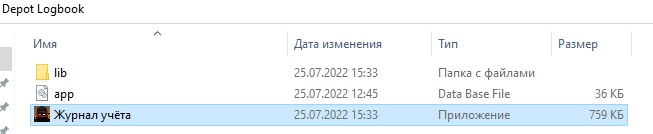
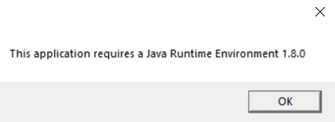
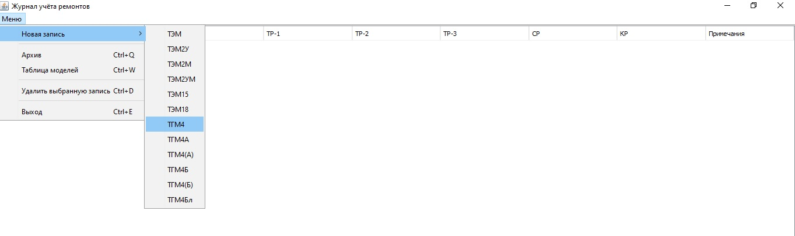
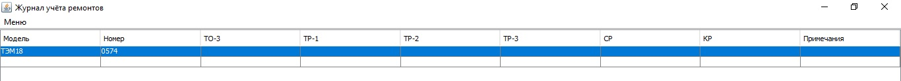
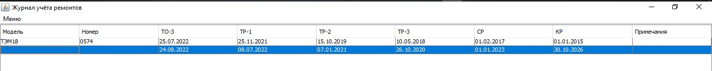
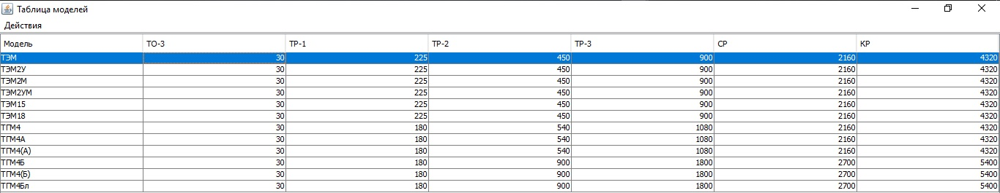

# Журнал учёта ремонтов для локомотивного депо

## Содержание
* [Установка на Windows](#Установка-на-Windows)
* [Установка на GNU/Linux или Mac OS](#Установка-на-GNU/Linux-или-Mac-OS)
* [Работа с журналом](#Работа-с-журналом)

### Установка на Windows
1. Загрузите *zip* архив.
2. Распакуйте содержимое архива в любую папку.
3. Запустите приложение двойным щелчком по файлу с названием "Журнал учёта".

> Примечание: для работы приложения на вашем компьютере должна быть установлена среда выполнения Java программ (Java Runtime Environment).
>
> Если приложение не обнаружит на компьютере JRE, при запуске будет показано соответствующее сообщение. Нажав "OK", вы перейдете на официальный сайт Oracle, где можно загрузить установщик JRE:

>
> После загрузки запустите установщик и пройдите стандартную процедуру установки программ. 
> После установки JRE можно начать работу с журналом учёта!

### Установка на GNU/Linux или Mac OS
1. Загрузите *zip* архив с версией программы для вашей системы.
2. Распакуйте содержимое архива в любую папку.
3. В папке приложения зайдите в директорию **bin** и запустите из терминала сценарий командной оболочки "locomotive\_depot\_logbook":
> `./locomotive_depot_logbook`

### Работа с журналом
1. После первого запуска программы вы увидите чистую таблицу, готовую для новых записей.
2. Чтобы добавить запись о новом тепловозе, откройте "Меню", выберете нужную модель тепловоза и укажите его номер:

3. Новая запись займёт две строки журнала: в первой строке можно записать дату последнего ремонта определённого вида; во второй строке вы увидите автоматически рассчитанную дату следующего ремонта этого вида:

4. Если вами была указана дата для ремонта, который включает в себя меньшие по объёму ремонты, даты для меньших ремонтов также будут перерасчитаны.
5. Периоды ремонтов для автоматического расчёта дат указываются в "Таблице моделей". Данные о моделях можно добавлять, изменять и удалять:

6. "Архив" хранит записи, удалённые из журнала ремонтов. Очистка архива удалит данные безвозвратно.
