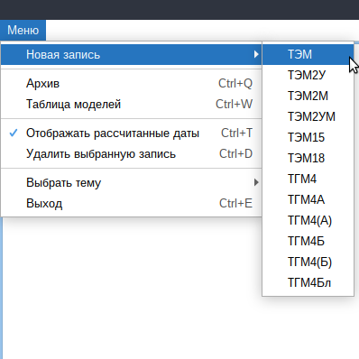

# Журнал учёта ремонтов для локомотивного депо
Данная прикладная программа упрощает учёт и планирование произведённых и предстоящих ремонтов тепловозов для сотрудников локомотивного депо.
После указания последнего ремонта определённой разновидности, даты запланированных ремонтов будут рассчитаны автоматически, с учётом установленных периодов ремонтов для каждой конкретной модели тепловоза.

---

## Содержание
* [Установка на Windows](#установка-на-windows)
* [Установка на GNU/Linux](#установка-на-gnulinux)
* [Работа с журналом](#работа-с-журналом-учёта)
* [Сборка](#сборка)
* [Версия](#версия)
* [Использованные ресурсы](#использованные-ресурсы)

---

### Установка на Windows
1. Загрузите [архив для *Windows*](https://drive.google.com/file/d/1njFuHKjtOpbPDnJkM05OYD9DBZ2NlWBH/view?usp=sharing).
2. Распакуйте содержимое архива в любую папку.
3. Запустите приложение.

> Примечание: для работы приложения требуется среда выполнения Java программ (*Java Runtime Environment*).
>
> Если приложение не обнаружит на компьютере JRE, при запуске будет показано соответствующее сообщение.
> Нажав "OK", вы перейдете на официальный сайт Oracle, где можно загрузить установщик JRE.
>
> После загрузки запустите установщик и пройдите стандартную процедуру установки программ. 
>
> После установки JRE можно начать работу с журналом учёта!

---

### Установка на GNU\/Linux
1. Загрузите [архив для *Linux*](https://drive.google.com/file/d/15oYhv9de594bfqOdxGt4Y2eRhgWtkb80/view?usp=sharing).
2. Распакуйте содержимое архива в любую папку.
3. В папке приложения перейдите в директорию **bin** и запустите из терминала сценарий командной оболочки:
`./Depo_Logbook_1.0`

> Примечание: для работы приложения требуется среда выполнения Java программ (*Java Runtime Environment*).
>
> Для Linux загрузить и установить JRE можно пройдя по ссылке: [linux_install](https://www.java.com/ru/download/help/linux_x64_install.html)
>
> После установки на *Linux* добавьте следующую строчку в файл запуска ~/.bashrc (или аналог):
>
> `export JAVA_HOME=\*путь к директории с JRE включая саму директорию\*`  
> 
> После установки JRE можно начать работу с журналом учёта!

---

### Работа с журналом учёта
1. После первого запуска программы вы увидите чистую таблицу, готовую для новых записей.
2. Чтобы добавить запись о новом тепловозе, откройте "Меню", выберете нужную модель тепловоза и укажите его номер:

3. Новая запись займёт две строки журнала: в первой строке можно записать дату последнего ремонта определённого вида; во второй строке вы увидите автоматически рассчитанную дату следующего ремонта этого вида:

4. Если была указана дата для ремонта, который включает в себя меньшие по объёму ремонты, даты для меньших ремонтов будут рассчитаны от даты более крупного ремонта.
5. Периоды ремонтов для автоматического расчёта дат указываются в *"Таблице моделей"*.
6. Из указанных вами дат программа выберет и отобразит последний произведённый ремонт.
7. На основе автоматически рассчитанных дат программа определит и отобразит следующий требуемый ремонт: сначала будет выполнен поиск просроченных ремонтов и если такой ремонт будет найден, программа выделит его особым цветом. При обнаружении нескольких просроченных ремонтов программа отдаст предпочтение ремонту наибольшего объёма. 
Если просроченных ремонтов нет, будет выбран ближайший запланированный ремонт. Если несколько ремонтов приходятся на один и тот же месяц, программа отдаст предпочтение ремонту наибольшего объёма независимо от дат ремонтов в границах одного месяца.

8. Для повышения читаемости таблицы рассчитанные даты можно скрыть или показать:

9. Приложение поддерживает тёмную тему:

---

### Сборка
1. Клонировать репозиторий:

  `git clone https://github.com/AntonMankovsky/locomotive_depot_logbook.git`
  
2. В файле *src/main/resources/flyway.properties* изменить путь до директории *locomotive_depot_logbook/* на ваш собственный (также заменить все / на \ для Windows).

3. В корневой директории проекта выполнить задачу
  
`./gradlew flywayMigrate`

4. Запустить программу:

  `./gradlew bootRun`
  
  или выполнить полную сборку с запуском тестов:
  
  `./gradlew build`

---

### Версия
1.1 — улучшены механизмы редактирования ячеек, удалены некоторые предустановленные модели тепловозов.

---

### Использованные ресурсы

<ul>
<li>Основа для светлой и тёмной тем:

<a href="https://github.com/JFormDesigner/FlatLaf" title="FlatLaf">FlatLaf - Swing Look and Feel created by FormDev</a>

<li>Иконка приложения во время работы программы:

<a href="https://www.flaticon.com/free-icons/train" title="train icons">Train icons created by Vectors Market — Flaticon</a>
</ul>
